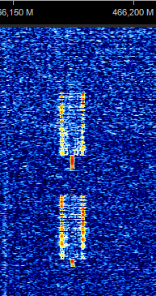

# SIGINT Game

## But du jeu

Lors d'une analyse de spectre, les signaux ci-joints ont été capturés.
Identifiez ces signaux et déduisez-en l'environnement qui vous entoure

## Captures

| Id | Freq (Mhz) | Capture |
|:----:|----: |:---------:|
|1| 107 | |
|2| 433 | |
|3| 121 | |
|4| 148 | |
|5| 2400 | |
|6| 1889 | |
|7| 2400 | |
|8| 466 | |
|9| 433 | |
|10| 433 | 

## Tips

Utilisez SIGWIKI / ARTEMIS et les outils SDR à votre disposition pour retrouver ces signaux et les identifier

