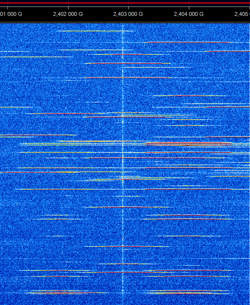

# SIGINT Game

## But du jeu

Lors d'une analyse de spectre, les signaux ci-joints ont été capturés.
Identifiez ces signaux et déduisez-en l'environnement qui vous entoure

## Captures

| id | capture |
|----|:---------:|
|1| |
|2| |
|3| |
|4| |
|5| |
|6| |
|7| |
|8| |
|9| |

## Tips

Utilisez SIGWIKI / ARTEMIS et les outils SDR à votre disposition pour retrouver ces signaux et les identifier

